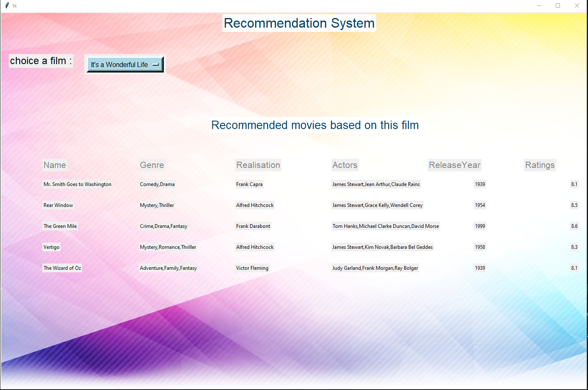

# Movie Recommendation System

This project implements a movie recommendation system using content-based filtering. It consists of two main parts:

1. **Web Scraping and Data Collection (Scraper.py):**
   - Utilizes requests and BeautifulSoup libraries for web scraping IMDb's top films chart.
   - Extracts movie details such as name, realization, actors, genre, release year, and ratings.
   - Saves the collected data in a CSV file named `data.csv`.

2. **Recommendation System with GUI (movie_recommendation_system.py):**
   - Loads movie data from the `data.csv` file.
   - Combines textual features into one column and performs feature extraction using TfidfVectorizer.
   - Calculates the cosine similarity matrix for movie recommendations.
   - Provides a Tkinter-based graphical user interface for users to choose a film and get recommendations.

## How to Use

1. Clone the repository to your local machine.
2. Install the required libraries using: `pip install -r requirements.txt`.
3. Run `Scraper.py` to scrape IMDb data and generate the `data.csv` file (load the existing file).
4. Run `movie_recommendation_system.py` to start the movie recommendation system GUI.

## Dependencies

- [requests](https://docs.python-requests.org/en/master/)
- [BeautifulSoup](https://www.crummy.com/software/BeautifulSoup/)
- [pandas](https://pandas.pydata.org/)
- [scikit-learn](https://scikit-learn.org/)
- [tkinter](https://docs.python.org/3/library/tkinter.html)
- [Pillow (PIL)](https://pillow.readthedocs.io/)

## Screenshots

## Contributing

Feel free to contribute to the project by opening issues or submitting pull requests.

## License

This project is licensed under the MIT License - see the [LICENSE](LICENSE) file for details.
